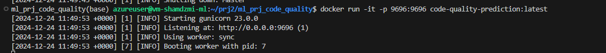
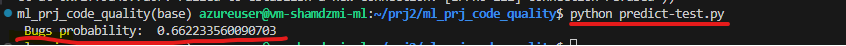

# Software Code Defects Prediction

## Table of Contents
1. [Problem Description](#1-problem-description)
2. [Data Analysis](#2-data-analysis)
3. [Exploratory Data Analysis Results](#3-exploratory-data-analysis-results)
4. [Models Training and Evaluation](#4-models-training-and-evaluation)
5. [Source Code](#5-source-code)
6. [Dependency Management](#6-dependency-management)
7. [Containerization](#7-containerization)
8. [Test Run](#8-test-run)

## 1. Problem Description
Project is aiming to predict a probabilty of a software code to have a defect. For ML model training it uses one of the NASA Metrics Data Program defect data sets. Data from software for storage management for receiving and processing ground data. Data comes from McCabe and Halstead features extractors of source code. These features were defined in the 70s in an attempt to objectively characterize code features that are associated with software quality.

**Project Goal**: Predict a software has defects or not.

The dataset used in this project is publicly available at [OpenML Dataset](https://www.openml.org/search?type=data&sort=runs&status=active&id=1067).

### Dataset Fields

Dataset contains of following features:

- `loc`: numeric - McCabe's line count of code
- `v(g)`: numeric - McCabe "cyclomatic complexity"
- `ev(g)`: numeric - McCabe "essential complexity"
- `iv(g)`: numeric - McCabe "design complexity"
- `n`: numeric - Halstead total operators + operands
- `v`: numeric - Halstead "volume"
- `l`: numeric - Halstead "program length"
- `d`: numeric - Halstead "difficulty"
- `i`: numeric - Halstead "intelligence"
- `e`: numeric - Halstead "effort"
- `b`: numeric - Halstead
- `t`: numeric - Halstead's time estimator
- `lOCode`: numeric - Halstead's line count
- `lOComment`: numeric - Halstead's count of lines of comments
- `lOBlank`: numeric - Halstead's count of blank lines
- `lOCodeAndComment`: numeric
- `uniq_Op`: numeric - unique operators
- `uniq_Opnd`: numeric - unique operands
- `total_Op`: numeric - total operators
- `total_Opnd`: numeric - total operands
- `branchCount`: numeric - count of the flow graph
- `problems`: {false, true} - module has/has not one or more reported defects


## 2. Data Analysis
Data analysis and model selection are performed in the Jupyter notebook: `code_quality_ml.ipynb`.

### Notebook Sections
1. Download dataset
2. Prepare data
3. Exploratory Data Analysis (EDA)
4. Train models

All steps are designed to be fully reproducible.

## 3. Exploratory Data Analysis Results
EDA performed in the aforementioned notebook reveals:
- About 15% of software code hass defects.
- According to the Corellation analysis of numerical features, the most important are:
      - total operands (total_Opnd)
      - unique operators(uniq_Op)
      - unique operands(uniq_Opnd)
      - Halstead "difficulty" (d)

## 4. Models Training and Evaluation
Four models were evaluated: Logistic Regression, Random Forest, Decision Tree, and XGBoost. Each model's performance was assessed using the Area Under the Curve (AUC) metric, then tuned to maximize AUC values:

| Model               | Max AUC |
|---------------------|---------|
| Logistic Regression | 0.794   |
| Decision Tree       | 0.779   |
| Random Forest       | 0.818   |
| XGBoost             | 0.775   |

`Random Forest` achieved the best result with parameters `n_estimators=140` and `max_depth=30`, and thus was selected for deployment.

## 5. Source Code
The project includes three Python scripts:
- `train.py`: Trains the selected model on the dataset and saves it to `model.bin`.
- `predict.py`: Launches a Flask web service on port `9696` with a `/predict` API method. It accepts JSON with customer data as input and returns the prediction.
- `predict-test.py`: Auxiliary script that calls the API on `localhost:9696/predict` with sample JSON, and prints out the prediction result.

## 6. Dependency Management
The project uses `pipenv` for environment isolation and dependency management. To set up the environment and install all required dependencies:
```bash
pipenv shell
pipenv install
```


## 7. Conteinerization
Application can be packed into a Docker-image. Dockerfile contains instructions to build a docker-image.
In order to build docker immage, excute:
```bash
docker build -t code-quality-prediction .
```
In order to launc the docker-container (and forward the port 9696) execute the comand:
```bash
docker run -it -p 9696:9696 code-quality-prediction:latest
```

## 8. Test run
  Start the docker-conatiner with the main aplication: 

   

  Run a test-scrit from a separate terminal window:

   


